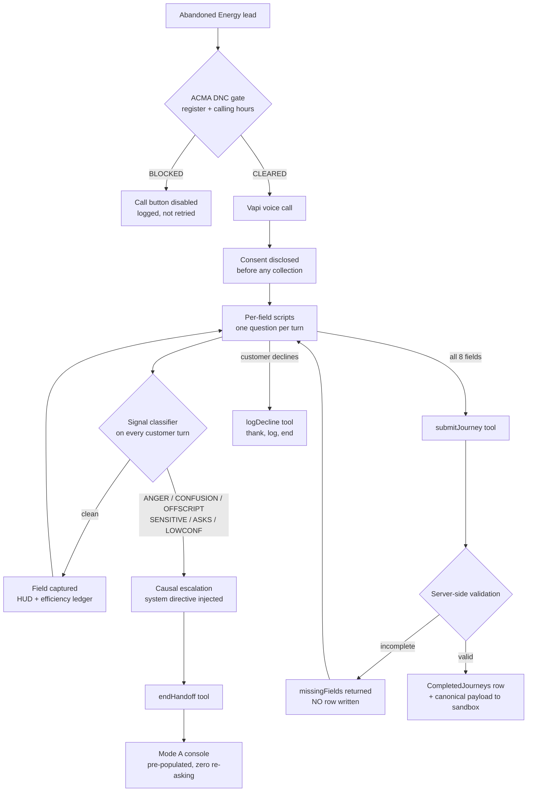

# CIMET / Econnex — Energy Journey Recovery

**Autonomous dropout recovery over voice, with signal-classified warm escalation.**
Jaipur 12-hour engineering hackathon · Energy vertical · solo build.

---

## 1. What this is

CIMET recovers abandoned comparison journeys by having human agents call customers
back, read scripts field by field, and complete the journey in an iframe on the
customer's behalf. It works, and it costs a human ~7 minutes per lead.

This build replaces the human on the recoverable calls, and — more importantly —
knows which calls are not recoverable by a machine and hands those back with
everything already collected.

**Scope: Energy (Electricity & Gas).** The brief scopes the build to one vertical
and explicitly rewards depth over breadth. Broadband is retained only as a
secondary demo that the backend normalises both verticals into one payload; it is
not the submission target.

---

## 2. Architecture



### The three seams that matter

**1. Disposition is driven by tool calls, not by phrases.**
`submitJourney` / `endHandoff` / `logDecline` firing is what moves the UI — the
same signal the backend acts on. An earlier iteration string-matched the
assistant's own words (`"one moment"`, `"congratulations"`) and mis-fired on
ordinary filler.

**2. Validation lives on the server.**
`submitJourney` re-checks all eight fields and returns
`{"status":"incomplete","missingFields":[…]}` rather than writing a partial row.
The model is told to act on that response, which turns a silent data-quality
failure into a self-correcting loop.

**3. One adapter seam.**
`buildJourneyPayload()` is the only place the outbound shape is defined. When
CIMET supplies the real sandbox schema, it maps there and nowhere else.

---

## 3. Compliance — where each guardrail actually lives

| Guardrail | Implementation | File |
| :-- | :-- | :-- |
| **Consent first** | Recording disclosed in the first message, before any field is sought | `vapi-prompt-options.md` |
| **DNC aware** | `checkDncLocal()` runs **before dialling** and disables the call button; `checkDnc()` mirrors it server-side and logs every check | `energy-recovery-demo.html`, `energy-agent-backend.gs` |
| **No card by voice** | Agent interrupts mid-sequence if digits start, escalates with trigger `SENSITIVE`; no card parameter exists in any tool schema | `vapi-prompt-options.md` |
| **No advice** | Recommendation requests escalate with trigger `OFFSCRIPT` | `vapi-prompt-options.md` |
| **Respect "no"** | One decline → thank, `logDecline`, end. No counter-offer, no second ask | `vapi-prompt-options.md` |

### On the DNC gate specifically

Two classes of block, deliberately not equivalent:

- **Register listing → hard block.** Not overridable, not even for the demo.
- **Calling hours → soft block,** overridable with an explicit logged
  acknowledgement, because the demo runs from Jaipur at hours that are not
  9am–8pm in Sydney.

Collapsing those two into one control would be the easy thing to build and the
wrong thing to build. The register is a legal prohibition; the hours window is a
scheduling constraint an operator can knowingly accept responsibility for.

The register itself is stubbed — the brief permits this ("You may stub it — but
show where it sits"). The seam is `checkDncLocal()`; production swaps the lookup
for the ACMA washing API.

---

## 4. Escalation — the six signals

Every customer turn is classified. These map directly to brief p.4:

| Signal | Weight | Fires on |
| :-- | :-: | :-- |
| `SENSITIVE` | 70 | card, bank, BSB, payment, dispute, refund |
| `ASKS` | 60 | "speak to a person", "supervisor", "put me through" |
| `ANGER` | 45 | "stop calling", "wasting my time", "this is the second call" |
| `CONFUSION` | 30 | "I already told you", "say that again" |
| `OFFSCRIPT` | 25 | "which plan do you recommend", any request for advice |

`SENSITIVE` and `ASKS` escalate on the spot. The others accumulate against the
sentiment score; crossing 30% escalates.

**The sentiment meter is causal, not decorative.** Crossing the threshold calls
`vapi.send()` to inject a system directive into the live call instructing the model
to stop collecting and hand off immediately. A meter that only animates while the
model decides on its own is theatre.

Verified against the brief's own transcript lines:

```
[ANGER    ] "Look, I've already told three of you my details. This is the second call today."
[ANGER    ] "Honestly I'm done with this — just stop calling me."
[SENSITIVE] "Can I just give you my credit card number now?"
[OFFSCRIPT] "Which plan do you recommend for me?"
[ASKS     ] "Put me through to a real person."
[clean    ] "Yes, my supply address is 45 Station Rd, Burwood."      ← no false positive
```

---

## 5. Efficiency evidence (25% criterion)

The left panel carries a live ledger rather than an assertion:

| Metric | Source |
| :-- | :-- |
| Fields auto-captured | Counted as the HUD fills |
| Keystrokes saved | Character count of every captured value |
| Human agent time | 0s autonomous; 90s on an escalated call (post-handoff only) |
| Manual baseline | 420s — 7 min average agent handling time per manual recovery |
| Agent time reclaimed | Derived |

Measured on the built scenarios:

- **Completed journey:** 8/8 fields, 105 keystrokes saved, **420s of agent time reclaimed (100%)**
- **Escalated journey:** 90s of agent time consumed, **330s reclaimed (79%)**

The escalated figure is the honest one to lead with. A system that claims 100%
on every call is claiming it never needs a human, which contradicts the entire
premise of the brief.

---

## 6. Field extraction

Two layers, in priority order:

1. **Question-intent matching.** `detectAskedField()` identifies which field the
   assistant just sought, so the customer's next utterance is bound to it. This
   handles arbitrary real-world answers — real names, real addresses — that no
   keyword list could anticipate.
2. **Keyword fallback** for retailers, fuel types and formats.

The matcher is filtered to fields that exist in the current vertical. Without that
filter, "who are you with?" on an Energy call matched the Broadband `isp` entry
first, bound the answer to a field the Energy HUD does not have, and **silently
dropped the customer's retailer** — a defect on the primary path found and fixed
during verification.

---

## 7. Verification performed

**Backend** (stubbed Apps Script globals, executed):

| Test | Result |
| :-- | :-- |
| Complete Energy journey | `{"status":"submitted"}`, correct 14-column row |
| Incomplete journey | `{"status":"incomplete","missingFields":[6 fields]}`, **no row written** |
| Broadband alias normalisation | Maps to canonical Energy names |
| Canonical payload shape | Verified field-by-field |
| Solar parsing | `"No solar"`→false, `"Yes, 5kW"`→true, `"none"`→false, `"I have panels"`→true |
| DNC gate | Clean→CLEARED, listed→BLOCKED |
| Handoff | Returns `contextPassed: "2 fields"` |

**Frontend** (executed against a stub DOM):

| Test | Result |
| :-- | :-- |
| Module evaluation | No reference errors |
| Hard vs soft DNC block | Register listing survives the override ✓ |
| Signal classifier | All 6 signal types; no false positive on a clean answer |
| Question→field routing | 13/13 across both verticals |
| Happy path simulation | 8/8 fields, ledger correct, disposition set |
| Escalation simulation | Classifier-driven, 79% reclaimed, console armed |
| Decline simulation | Logged, counted, zero agent time |

---

## 8. Known limitations

State these before a judge finds them.

1. **The call is browser WebRTC, not outbound PSTN.** The brief says "place the
   call." `vapi.start()` runs a web call from the laptop mic. Outbound telephony
   requires a server-side `POST /call` with a `phoneNumberId` and a private key —
   the prompt, tools, guardrails and backend are all telephony-ready and unchanged
   by that switch, but the dial-out path itself is not built.
2. **`SPREADSHEET_ID` must be set before the demo.** The backend now throws a clear
   configuration error instead of failing silently, but it is still a manual step.
3. **The DNC register is stubbed**, as the brief permits.
4. **The journey submits to Google Sheets**, not CIMET's sandbox, until
   `JOURNEY_SANDBOX_URL` is set. The canonical payload and the single adapter seam
   exist precisely so that swap is a one-function change.
5. **Escalation classification is deterministic pattern matching**, not a learned
   sentiment model. That is a defensible choice at this scale — it is auditable,
   has no latency cost, and every trigger is explainable to a compliance reviewer —
   but it will miss sarcasm and tone carried purely in prosody.

---

## 9. Demo sequence

1. **Open on Energy.** Three leads. Point at Liam — red `DNC BLOCKED` badge,
   call button disabled. *The gate runs before the phone rings, not after.*
2. **Select David, run the live call** (or simulation 1 if the room is loud).
   Watch the HUD fill and the efficiency ledger climb. Land on 8/8.
3. **Show the Sheet** — the row, and the `FieldsAuto` column.
4. **Run `testSubmitIncompleteJourney()`** — the system refuses to record a journey
   it did not complete.
5. **Run simulation 2.** Ananya pushes back; signals classify; sentiment falls;
   handoff fires. Open Aarav's console — every field already there.
6. **Run simulation 3.** One "no", thanked, logged, ended.
7. **Close on the limitations above.** Stating them is stronger than being caught
   by them.

---

## 10. Files

| File | Purpose |
| :-- | :-- |
| [energy-recovery-demo.html](energy-recovery-demo.html) | Mission Control UI — pipeline, DNC gate, live call, HUD, classifier, ledger, Mode A console |
| [energy-agent-backend.gs](energy-agent-backend.gs) | Apps Script webhook — 4 tools, validation, canonical payload, DNC, sandbox mirror |
| [vapi-prompt-options.md](vapi-prompt-options.md) | Energy per-field scripts, objections, guardrails |
| [vapi-agent-setup-guide.md](vapi-agent-setup-guide.md) | Tool schemas, deployment, troubleshooting |
| [energy-dataset-integration-skill.md](energy-dataset-integration-skill.md) | Procedure for wiring CIMET's real dataset and sandbox spec |
