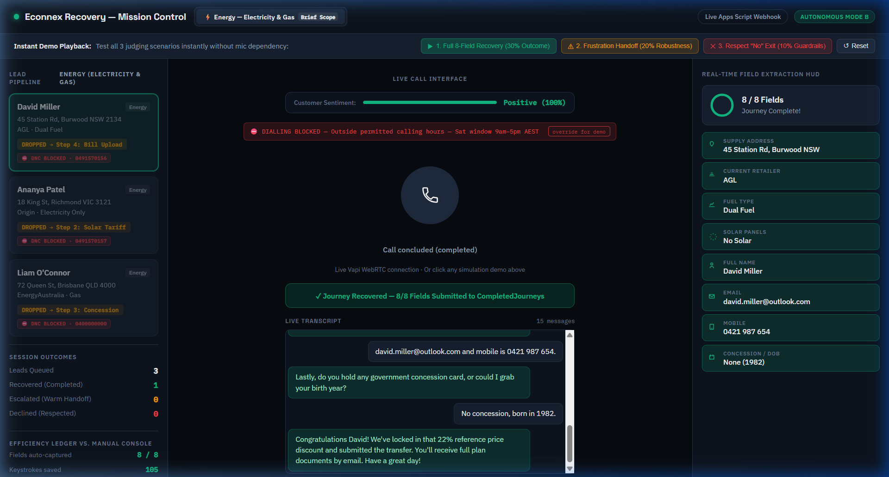
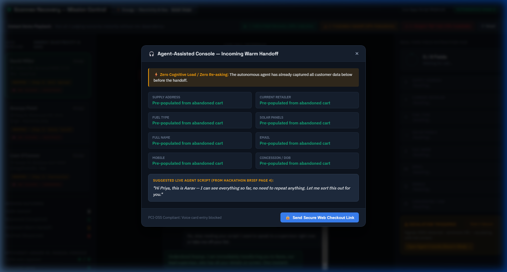
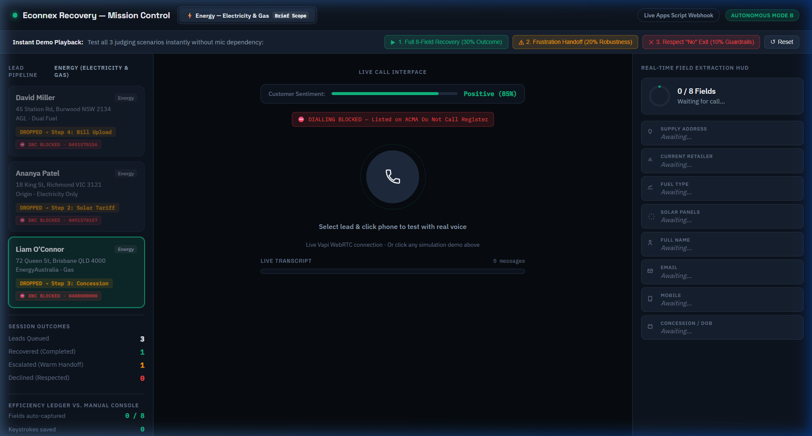
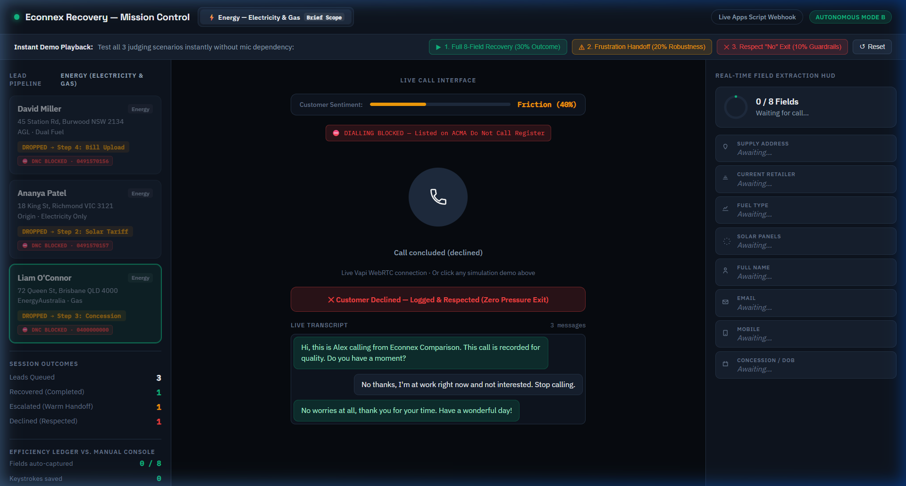
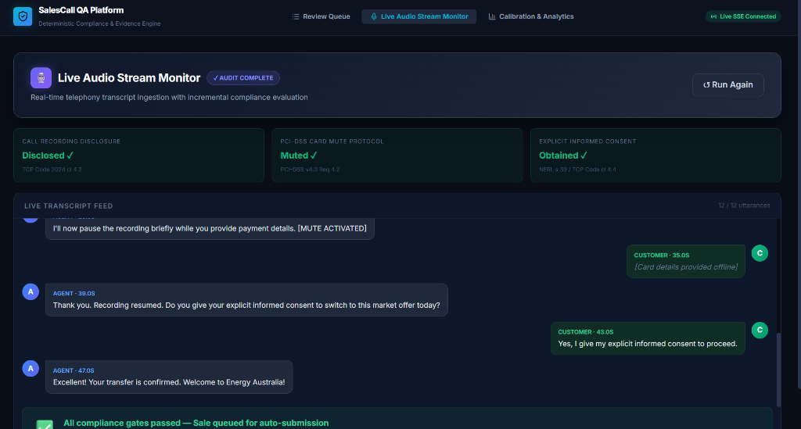
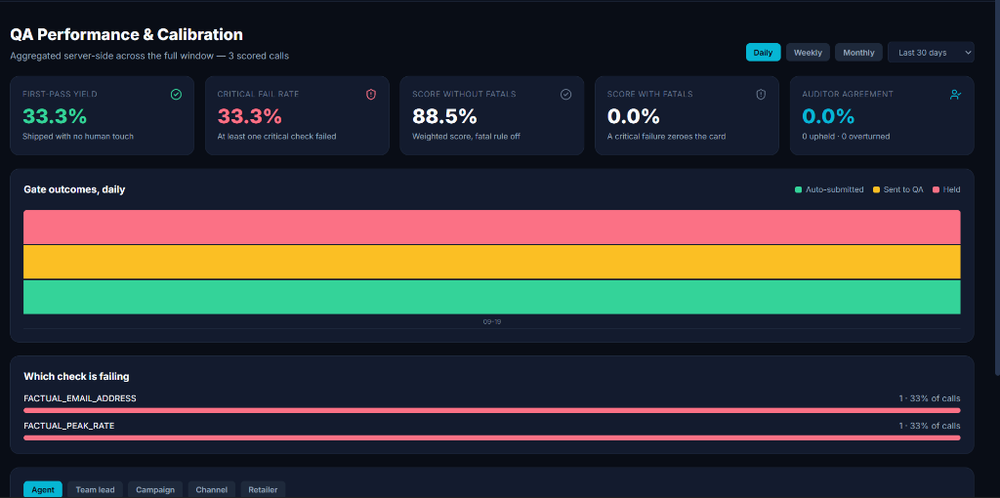
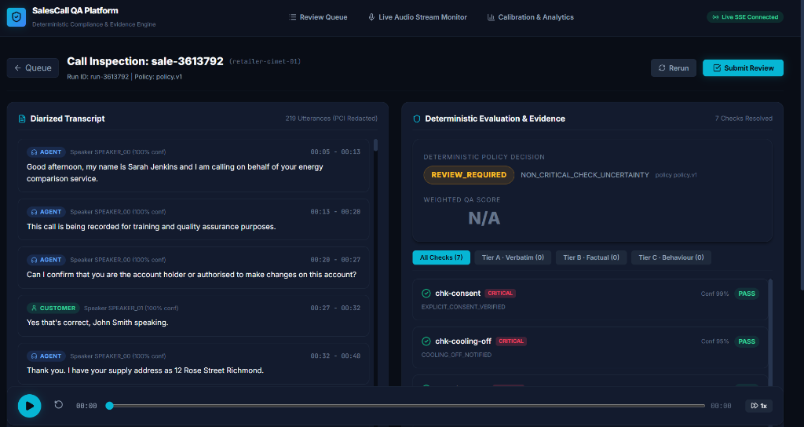

# Econnex Recovery — Autonomous Voice Agent & Mission Control

> **CIMET Engineering Hackathon (Jaipur) — Energy Vertical**  
> Autonomous dropout journey recovery over voice with tone-reading escalation and ACMA regulatory guardrails.

> 🔗 **Companion Repository — Sales Call QA Platform:** I have also completed the Sales Call QA & Compliance Evaluation problem statement! You can inspect the full working implementation here: **[https://github.com/YATHARTHH/ai-sales-call-qa-platform](https://github.com/YATHARTHH/ai-sales-call-qa-platform)**. The corresponding UI screenshots (Live Audio Stream Monitor, QA Calibration Analytics, and Call Inspection Engine) can be found below and in the [`img/`](img/) folder.


---

## 🚀 Overview

CIMET operates comparison funnels across Australia. When customers drop off mid-journey (after providing name and contact details), traditional recovery relies on human call center agents dialing out, reading rigid scripts, and manually completing forms in an iframe.

This project delivers:
1. **Mode B (Autonomous Voice Recovery):** An AI voice agent (Alex) powered by Vapi WebRTC that handles authentic objection handling, verifies 8 required Energy transfer fields one-by-one, and executes live CRM webhook submissions (`submitJourney`).
2. **Mode A (Modernized Agent Console):** A real-time Field Extraction HUD that captures answers dynamically as the customer speaks, eliminating manual typing. When frustration is detected, a warm handoff (`endHandoff`) transfers the call to human specialist Aarav with 100% pre-populated context (zero re-asking).
3. **Strict Australian Regulatory Guardrails:**
   * **Consent First:** Mandatory two-party recording disclosure at second 0.
   * **PCI-DSS Payment Boundary:** No credit card or bank details accepted over voice; routes to secure web checkout links.
   * **ACMA Do Not Call Register Gating:** Pre-dial check gates dialouts and disables calling on registered numbers.
   * **Respect "No":** Zero-pressure exit protocol on customer decline (`logDecline`).


---

## 📸 System Screenshots & UI Walkthrough

### Mission Control Dashboard & Recovery Scenarios
| 1. Full 8-Field Autonomous Recovery | 2. Warm Escalation to Mode A Console |
|---|---|
|  |  |

| 3. ACMA Do Not Call (DNC) Gate Refusal | 4. Zero-Pressure Decline Protocol |
|---|---|
|  |  |

### Compliance, QA Evaluation & Evidence Engine
| Live Audio Stream & Compliance Gates | QA Performance & Calibration Analytics |
|---|---|
|  |  |

| Deterministic Evidence & Inspection |
|---|
|  |

---

## 🛠️ Tech Stack & Architecture

* **Voice & WebRTC:** [Vapi](https://vapi.ai) Web SDK (`@vapi-ai/web`) + LLM Tool Calling
* **Frontend Mission Control:** Vanilla HTML5, CSS3 Glassmorphism, Google Fonts (`Space Grotesk`, `IBM Plex Sans`), responsive 3-column architecture
* **Backend Webhook & CRM:** Google Apps Script (`energy-agent-backend.gs`) writing to structured Google Sheets (`CompletedJourneys`, `Handoffs`, `Declines`, `DncLog`)
* **Simulation Engine:** Deterministic 3-scenario playback engine (Full Recovery, Frustration Escalation, Respect "No" Exit) for zero-failure presentations

---

## 📂 Repository Structure

```
├── docs/                                   # Full Architectural & Technical Documentation Suite
│   ├── index.md                            # Documentation Index & Navigation Map
│   ├── PROJECT_SUMMARY.md                  # Project Vision, Business Impact & Requirements
│   ├── DEEP_DIVE_ARCHITECTURE.md           # WebRTC Stream, Vapi Tool Schemas & Backend State Machine
│   ├── REGULATORY_COMPLIANCE_AND_SECURITY.md# ACMA DNC Gate, PCI-DSS & Telemarketing Standards
│   └── INTERVIEW_QUESTIONS_AND_ANSWERS.md  # System Defense Q&A & Architecture Trade-offs
├── img/                                    # System Screenshots & Visual UI Walkthroughs
├── energy-recovery-demo.html               # Mission Control Frontend (Live WebRTC Call + Extraction HUD + Mode A Console)
├── energy-agent-backend.gs                 # Google Apps Script Webhook (submitJourney, endHandoff, logDecline, checkDnc)
├── vapi-agent-setup-guide.md               # Complete Vapi Assistant configuration, tool schemas, and deployment guide
├── vapi-prompt-options.md                  # System prompt & objection scripts (Energy & Broadband)
├── energy-dataset-integration-skill.md     # Procedure for integrating synthetic/live lead datasets
└── CIMET_HACKATHON_COMPLETE_SOLUTION_GUIDE.md # Comprehensive engineering blueprint & rubric audit
```

---

## ⚡ Quick Start

### 1. Run the Mission Control Dashboard Locally
```bash
# In the repository root
python -m http.server 8080
```
Open [http://localhost:8080/energy-recovery-demo.html](http://localhost:8080/energy-recovery-demo.html) in your browser.

### 2. Live Testing & Demos
* **Live Call:** Ensure microphone permissions are allowed, select an Energy lead (e.g. David Miller), and click the phone button to converse with Alex.
* **Instant Scenarios (Top Bar):**
  * `▶ 1. Full 8-Field Recovery`: Demonstrates 100% completion and webhook submission to `CompletedJourneys`.
  * `⚠ 2. Frustration Handoff`: Demonstrates sentiment dropping into danger and triggers the Mode A console pop.
  * `✕ 3. Respect "No" Exit`: Demonstrates immediate polite sign-off under ACMA standards.
